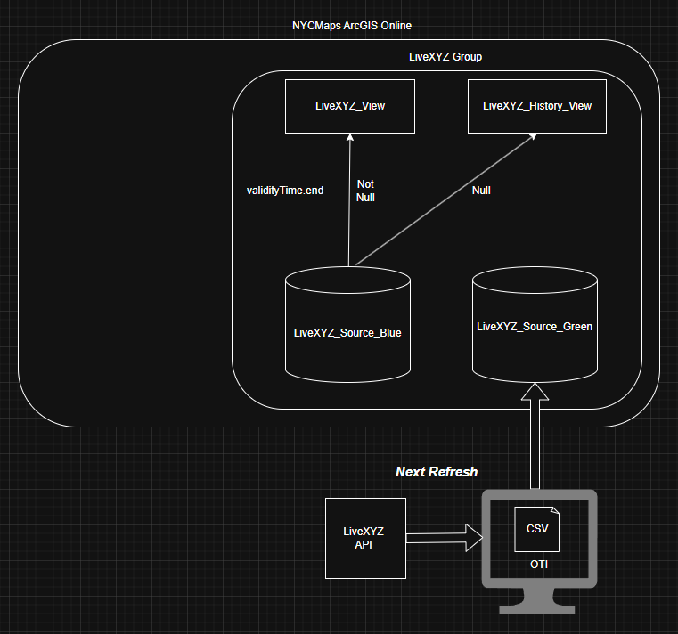

# agol_pub_livexyz

Publish [LiveXYZ](https://www.livexyz.com/) data to the NYCMaps ArcGIS Online organization.

### You will need

1. ArcGIS Pro installed (ie python _import_ _arcgis_)
2. API key to [LiveXYZ](https://www.livexyz.com/)
3. To publish, authentication to an ArcGIS Online organization (see [AGOL_Pub](https://github.com/mattyschell/agol_pub))

### Download LiveXYZ Data

We fetch all data, including historical records, and sort it out later when publishing. 

For all of the dataset.

1. Copy sample-fetch-all.bat to a new name.  
2. Get a key from [LiveXYZ](https://directory.livexyz.com/places).  
3. Update environmentals at the top of the script.

To fetch a sample of the dataset use sample-fetch-sample.bat

### ArcGIS Online: The Tentative Plan

