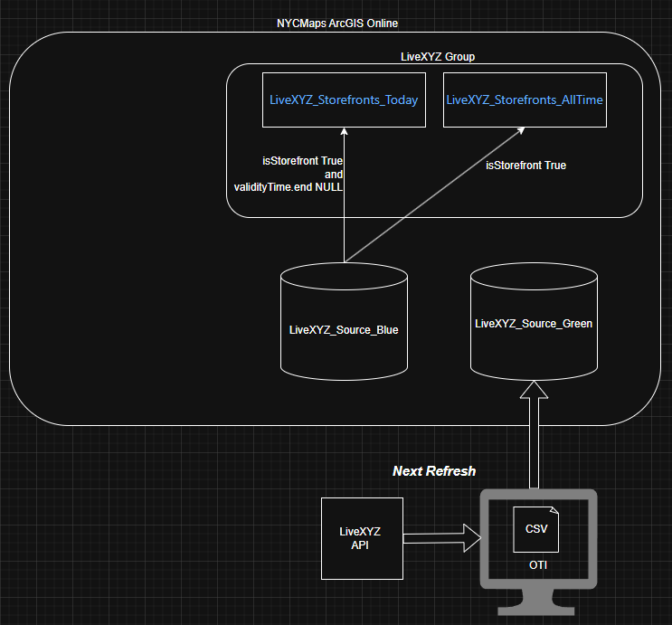

# agol_pub_livexyz

Publish [LiveXYZ](https://www.livexyz.com/) data to the NYCMaps ArcGIS Online organization.

### You will need

1. ArcGIS Pro 3.5+ installed (ie python _import_ _arcgis_)
2. API key to [LiveXYZ](https://www.livexyz.com/). 
   1. Personal user: Login to Live XYZ and get your java web token (jwt) 
   2. Service Account: You should have been provided a name and API key. 
3. To publish, authentication to an ArcGIS Online organization 
4. The [agol_pub](https://github.com/mattyschell/agol_pub) repository


### Download LiveXYZ Data

We fetch all data, including historical records and non-storefronts. We will front the data with views when presenting to users.

Authentication for fetch scripts supports either:

1. `LIVEXYZTOKEN` as a JWT token, or
2. `LIVEXYZ_SERVICE_ACCOUNT_NAME` + `LIVEXYZ_SERVICE_ACCOUNT_KEY`

These are environmental variables.

When using a service account, the script exchanges name/key for a JWT at
`https://auth-api.liveapp.com/authentication`.

#### Download All

1. Copy sample-fetchlivexyz-all.bat to a new name.  
2. Get a service account name and key from your administrator.  
3. Update the environmentals at the top of the script.

#### Download A Sample

The full dataset can be a lot to deal with. To fetch a smaller chunk of data:

1. Copy sample-fetchlivexyz-specimen.bat to a new name
2. Get a service account name and key from your administrator.
3. Update the environmentals LINESPERPAGE and TOTALPAGES to control the specimen size. For example 5 and 5 respectively will yield 25 rows.
4. Update the other environmentals

### ArcGIS Online: The Tentative Plan

The refresh uses the ArcGIS [Item.update()](https://developers.arcgis.com/python/latest/api-reference/arcgis.gis.toc.html#arcgis.gis.Item.update) method and incurs no credits.



### Download and Blue Green Rotation

See these two sample scripts. In combination they demonstrate a blue/green source rotation with 2 dependent views. Both parts have dependencies on [agol_pub](https://github.com/mattyschell/agol_pub). 

```shell
> geodatabase-scripts\sample-fetchlivexyz-all.bat
> geodatabase-scripts\sample-bluegreen.bat
```

### Test A Service Account 

The service account name and key should be securely stored and used judiciously. 

```shell
export HTTP_PROXY=http://xxxx.xxxx:xxxxx
export HTTPS_PROXY=$HTTP_PROXY
curl -X POST https://auth-api.liveapp.com/authentication \
  -H "Content-Type: application/json" \
  -d '{"name": "nameprovidedbysource", "key": "keyprovidedbysource"}'
```

Windows cmd-friendly

```
set HTTP_PROXY=http://xxxx.xxxx:xxxxx
set HTTPS_PROXY=%HTTP_PROXY%
curl -X POST "https://auth-api.liveapp.com/authentication" ^
  -H "Content-Type: application/json" ^
  -d "{\"name\":\"NameProvidedBySource\",\"key\":\"KeyProvidedBySource\"}"
```


