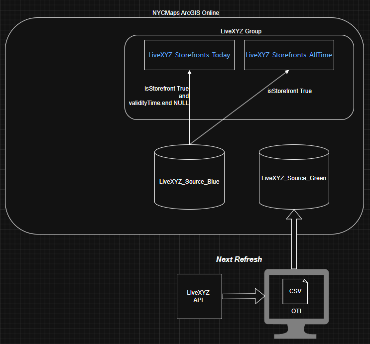

# agol_pub_livexyz

Publish [LiveXYZ](https://www.livexyz.com/) data to the NYCMaps ArcGIS Online organization.

### You will need

1. ArcGIS Pro 3.5+ installed (ie python _import_ _arcgis_)
2. API key to [LiveXYZ](https://www.livexyz.com/). 
   1. Personal user: Login to Live XYZ and get your java web token (jwt) 
   2. Service Account: You should have been provided a name and API key. 
3. To publish, authentication to an ArcGIS Online organization 
4. The [agol_pub](https://github.com/mattyschell/agol_pub) repository


### Download LiveXYZ Data

We fetch all data, including historical records and non-storefronts. We will front the data with views when presenting to users.

Authentication for fetch scripts supports either:

1. `LIVEXYZTOKEN` as a JWT token, or
2. `LIVEXYZ_SERVICE_ACCOUNT_NAME` + `LIVEXYZ_SERVICE_ACCOUNT_ORGANIZATIONID` + `LIVEXYZ_SERVICE_ACCOUNT_KEY`

These are environmental variables.

When using a service account, the script exchanges name/organization/key
for a JWT at
`https://auth-api.liveapp.com/authentication`.

#### Download All

1. Copy sample-fetchlivexyz-all.bat to a new name.  
2. Get a service account name, organization ID, and key from your
  administrator.  
3. Update the environmentals at the top of the script.

#### Download A Sample

The full dataset can be a lot to deal with. To fetch a smaller chunk of data:

1. Copy sample-fetchlivexyz-specimen.bat to a new name
2. Get a service account name, organization ID, and key from your
  administrator.
3. Update the environmentals LINESPERPAGE and TOTALPAGES to control the specimen size. For example 5 and 5 respectively will yield 25 rows.
4. Update the other environmentals

### ArcGIS Online

The refresh uses the ArcGIS [Item.update()](https://developers.arcgis.com/python/latest/api-reference/arcgis.gis.toc.html#arcgis.gis.Item.update) method and incurs no credits.



### Download and Blue Green Rotation

See these two sample scripts. In combination they demonstrate a blue/green source rotation with 2 dependent views. Both parts have dependencies on [agol_pub](https://github.com/mattyschell/agol_pub). 

See geodatabase-scripts\sample-livexyz-refresh.bat for the full download, load, swap, and QA workflow.  How much time does the full refresh take? Approximately 20 minutes. 

```shell
> geodatabase-scripts\sample-fetchlivexyz-all.bat
> geodatabase-scripts\sample-bluegreen.bat
```


### Test A Service Account 

The service account name, organization ID, and key should be securely stored
and used judiciously. 

```shell
export HTTP_PROXY=http://xxxx.xxxx:xxxxx
export HTTPS_PROXY=$HTTP_PROXY
curl -X POST https://auth-api.liveapp.com/authentication \
  -H "Content-Type: application/json" \
  -d '{"name": "nameprovidedbysource", "organizationId": "yourOrgId", "key": "keyprovidedbysource"}'
```

Windows cmd-friendly

```
set HTTP_PROXY=http://xxxx.xxxx:xxxxx
set HTTPS_PROXY=%HTTP_PROXY%
curl -X POST "https://auth-api.liveapp.com/authentication" ^
  -H "Content-Type: application/json" ^
  -d "{\"name\":\"NameProvidedBySource\",\"organizationId\":\"yourOrgId\",\"key\":\"KeyProvidedBySource\"}"
```

Use the returned bearer token to POST to the graphql endpoint.

```shell
curl -X POST https://graphql-enki.liveapp.com/features/648b1584fe16016869b2415a \
  -H "Content-Type: application/json" \
  -H "X-Auth-Token: Bearer YOUR_JWT_TOKEN" \
  -d '{"pageSize": 1, "validityTime": {"at": "now"}}'
```

Windows cmd-friendly

```cmd
curl -X POST "https://graphql-enki.liveapp.com/features/648b1584fe16016869b2415a" ^
  -H "Content-Type: application/json" ^
  -H "X-Auth-Token: Bearer YOUR_JWT_TOKEN" ^
  -d "{\"pageSize\":1,\"validityTime\":{\"at\":\"now\"}}"
```

### Filter Group Report CSV

Use filter_group_report.py to post-process the comma-delimited output from
agol_pub group-members-report.py.

What the script writes to output:

1. Rows where none of the checked columns match the allowed-domain patterns
2. Rows with blank user.email only when username/email do not match patterns

Filter order for each row:

1. If username is in allowlist, skip the row
2. Check each selected column against each glob pattern
3. If any selected column matches any pattern, skip the row
4. If user.email is blank and no pattern matched, write the row as suspect
5. If no selected columns match, write the row as suspect

Important rule:

1. Users with *nyc.gov* in username or user.email are treated as allowed
2. This includes LDAP-style usernames like me@agency.nyc.gov_nyc

Defaults:

1. Columns: username and user.email
2. Patterns: *nyc.gov* and *nypd.org*
3. Allowlist: empty
4. Output directory: same directory as input CSV

Output file name format:

1. livexyz-group-report-YYYYMMDD-HHMMSS.csv

If no suspect rows are found, the output file is created as a 0-byte file.

Usage:

```shell
python filter_group_report.py <infile.csv> \
  [--outdir DIR] \
  [--columns COL [COL ...]] \
  [--patterns GLOB [GLOB ...]] \
  [--allowlist-file FILE]
```

Examples:

1. Run with defaults:

```shell
python filter_group_report.py C:\temp\livexyz-group-report.csv
```

2. Use custom columns, patterns, and output directory:

```shell
python filter_group_report.py C:\temp\livexyz-group-report.csv \
  --columns username user.email \
  --patterns "*nyc.gov*" "*nypd.org*" \
  --outdir C:\temp
```

3. Exempt known-good blank-email users with an allowlist:

```shell
python filter_group_report.py C:\temp\livexyz-group-report.csv \
  --allowlist-file C:\temp\livexyz-group-report-allowlist.txt
```

Allowlist file format:

1. One username per line
2. Case-insensitive matching
3. Blank lines and lines starting with # are ignored

Example allowlist file (livexyz-group-report-allowlist.txt):

```text
# Known-good service/partner accounts with blank user.email
headless.user
internal.blank@agency.nyc.gov_nyc
```

Expected output walkthrough:

Input CSV rows (username, user.email):

```text
employee.user,employee@agency.nyc.gov
external.user,ext@example.com
headless.user,
```

Run without allowlist:

```shell
python filter_group_report.py C:\temp\livexyz-group-report.csv
```

Expected suspect rows written:

```text
external.user,ext@example.com
headless.user,
```

Why:

1. employee.user is filtered out because it matches *nyc.gov*
2. external.user is written because it does not match allowed patterns
3. headless.user is written because blank user.email did not match patterns

Run with allowlist containing headless.user:

```shell
python filter_group_report.py C:\temp\livexyz-group-report.csv \
  --allowlist-file C:\temp\livexyz-group-report-allowlist.txt
```

Expected suspect rows written:

```text
external.user,ext@example.com
```


